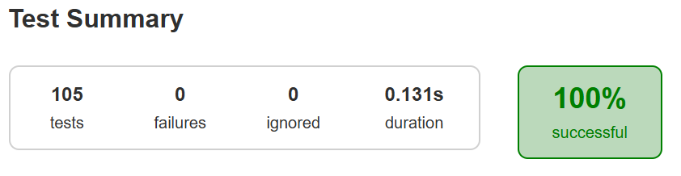

# Tson

Tson is a Java library that can be used to convert Java Objects into their [JSON](https://www.json.org/json-en.html) representation. It can also be used to convert a JSON string to an equivalent Java object.

## Using Tson

The primary class to use is `Tson` which you can just create by calling `new Tson()`. The `Tson` instance does not maintain any state while invoking JSON operations. So, you are free to reuse the same object for multiple JSON serialization and deserialization operations.

### Using Tson with Gradle

1. Clone the project and run `./gradlew build`.
2. Copy `lib.jar` from `lib/build/` to `libs` folder in your Gradle project.
3. Add following lines to your `build.gradle`.

```groovy
dependencies {
    implementation files('libs/lib.jar')
}
```

## Usage examples

All of the following examples are fully tested and confirmed to work. You can find the test cases in [ReadmeExamplesTest.java](./tson/lib/src/test/java/dev/tishenko/ReadmeExamplesTest.java).

### Primitives Examples

```java
// Serialization
Tson tson = new Tson();
tson.toJson(1);            // ==> 1
tson.toJson("abcd");       // ==> "abcd"
tson.toJson(Long.valueOf(10)); // ==> 10
int[] values = { 1 };
tson.toJson(values);       // ==> [1]

// Deserialization
int i = tson.fromJson("1", int.class);
Integer intObj = tson.fromJson("1", Integer.class);
Long longObj = tson.fromJson("1", Long.class);
Boolean boolObj = tson.fromJson("false", Boolean.class);
String str = tson.fromJson("\"abc\"", String.class);
String[] strArray = tson.fromJson("[\"abc\"]", String[].class);
```

### Object Examples

```java
class BagOfPrimitives {
  private int value1 = 1;
  private String value2 = "abc";
  private transient int value3 = 3;
  BagOfPrimitives() {
    // no-args constructor
  }
}

// Serialization
BagOfPrimitives obj = new BagOfPrimitives();
Tson tson = new Tson();
String json = tson.toJson(obj);

// ==> {"value1":1,"value2":"abc"}
```

Note that you can not serialize objects with circular references since that will result in infinite recursion.

```java
// Deserialization
BagOfPrimitives obj2 = tson.fromJson(json, BagOfPrimitives.class);
// ==> obj2 is just like obj
```

#### **Finer Points with Objects**

* It is perfectly fine to use private fields.
* There is no need to use any annotations to indicate a field is to be included for serialization and deserialization. All fields in the current class (and from all super classes) are included by default.
* If a field is marked transient, (by default) it is ignored and not included in the JSON serialization or deserialization.
* Anonymous, local and not static inner classes are excluded. They will be serialized as JSON `null` and when deserialized their JSON value is ignored and `null` is returned. Convert the classes to `static` nested classes to enable serialization and deserialization for them.

### Array Examples

```java
Tson tson = new Tson();
int[] ints = {1, 2, 3, 4, 5};
String[] strings = {"abc", "def", "ghi"};

// Serialization
tson.toJson(ints);     // ==> [1,2,3,4,5]
tson.toJson(strings);  // ==> ["abc","def","ghi"]

// Deserialization
int[] ints2 = tson.fromJson("[1,2,3,4,5]", int[].class);
// ==> ints2 will be same as ints
```

Tson also supports multi-dimensional arrays, with arbitrarily complex element types.

### Collections Examples

```java
Tson tson = new Tson();
Collection<Long> ints = Arrays.asList(1L, 2L, 3L, 4L, 5L);;

// Serialization
String json = tson.toJson(ints);  // ==> [1,2,3,4,5]
```

```java
// Deserialization
Collection<Long> ints2 = tson.fromJson(json, List.class);
// ==> ints2 is same as ints
```

Tson doesn't have information about types of elements of collection so by default it uses Long, Double, String, Boolean or List<Object>/Map<String,Object> for nested collections. 

### Maps Examples

Tson by default serializes any `java.util.Map` implementation as a JSON object. Because JSON objects only support strings as member names, Tson converts the Map keys to strings by calling `toString()` on them, and using `"null"` for `null` keys:

```java
Tson tson = new Tson();
Map<String, String> stringMap = new LinkedHashMap<>();
stringMap.put("key", "value");
stringMap.put(null, "null-entry");

// Serialization
String json = tson.toJson(stringMap); // ==> {"key":"value","null":"null-entry"}

Map<Integer, Integer> intMap = new LinkedHashMap<>();
intMap.put(2, 4);
intMap.put(3, 6);

// Serialization
String json = tson.toJson(intMap); // ==> {"2":4,"3":6}
```

Similar to the Collection, for deserialization of map elements Tson uses one of the following types: Long, Double, String, Boolean or List<Object>/Map<String,Object> for nested arrays/objects.

Map keys are always parsed as strings, other objects as keys are not supported in deserialization.

```java
Tson tson = new Tson();
String json = "{\"key\": \"value\"}";

// Deserialization
Map<String, String> stringMap = tson.fromJson(json, Map.class);
// ==> stringMap is {key=value}
```

## Strongness
- Provides simple `toJson` and `fromJson` methods which covers a lot of basic cases of working with JSON in Java.
- Has no external dependencies.
- Supports all JSON structures, including arrays with mixed types. Any valid JSON will be parsed correctly (`fromJson(json, Object.class)`).
- Rigorously tested with over 100 cases, covering a wide range of edge scenarios. See [test](./tson/lib/src/test/) folder.



## Limitations
- Types other than String are not supported in Maps when deserializing (but it works fine when serializing).
- Does not provide a way to set types of elements of collections when deserializaing.
- Generic Types are not supported.
- Error handling is basic and has not been thoroughly tested.
- Supports only minimal JSON (not human readable) format when serializing.
- Cyclic dependencies are not handled.