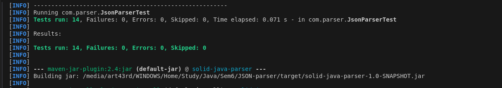

# JSON Parser

## 🚀 Особенности реализации

- Преобразование строк JSON в объекты Java
- Преобразование объектов Java в строки JSON
- Поддержка пользовательского сопоставления классов
- Обработка вложенных объектов и массивов
- Работа с коллекциями и наследованием
- Обработка нулевых значений
- Отсутствие внешних зависимостей

## 📋 Требования

- Java 21+
- Maven 3.6+

## 🛠 Установка проекта на своё устройство

Клонирование репозитория:

```bash
git clone https://github.com/artemis43rd/JSON-parser.git
cd JSON-parser
```

Создание проекта:

```bash
mvn clean install
```

## 🎯 Использование

Краткий пример того, как используется Java JSON Parser:

```java
JsonParser parser = JsonParserFactory.getParser();

// Parsing JSON to an object
String json = "{\"name\":\"John Doe\",\"age\":30}";
Person person = parser.parseToClass(json, Person.class);

// Converting an object to JSON
String jsonOutput = parser.toJson(person);
```

Ознакомьтесь с файлом `Main.java` для получения более подробных примеров использования.

```
1. Simple JSON object:
{name=John Doe, age=30, isStudent=false}

2. JSON array:
[1, 2, 3, 4, 5]

3. Complex JSON object:
{address={city=New York, street=123 Main St}, scores=[90, 85, 92], person={name=Jane Smith, age=25}}

4. JSON to Map:
{address={city=New York, street=123 Main St}, scores=[90, 85, 92], person={name=Jane Smith, age=25}}

5. JSON to custom class (Person):
Name: Alice Johnson, Age: 28

6. JSON with collections to custom class (PersonWithHobbies):
Name: Bob Williams, Age: 35, Hobbies: [reading, swimming, cycling]

7. Object to JSON:
{"name":"Charlie Brown","age":40}

8. Object with collections to JSON:
{"hobbies":["gardening","cooking","traveling"],"name":"David Clark","age":45}

9. JSON with null values:
{address=null, name=Eve Davis, age=null}

10. Empty JSON object and array:
Empty object: {}
Empty array: []
```

## 🧪 Тесты

Чтобы запустить набор тестов:

```bash
mvn test
```

Результаты:




## 💡 Принцип

Этот проект придерживается принципов SOLID:

- **S**ingle Responsibility: Каждый класс имеет единую, четко определенную цель
- **O**pen/Closed: Синтаксический анализатор открыт для расширения, но закрыт для модификации
- **L**iskov Substitution: Подтипы могут использоваться взаимозаменяемо
- **I**nterface Segregation: Клиенты не зависят от методов, которые они не используют
- **D**ependency Inversion: Высокоуровневые модули не зависят от низкоуровневых модулей
