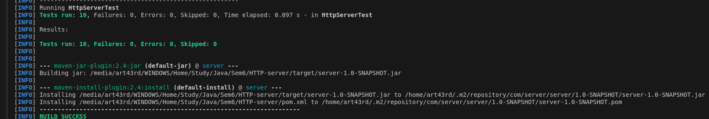

# HTTP-server

## 📋 Требования

- Java 21+
- Maven 3.6+

## 🚀 Особенности реализации

- **Поддерживаемые методы**:
    - `GET`
    - `POST`
    - `PUT`
    - `PATCH`
    - `DELETE`

- **Headers**: Доступны в виде `Map<String, String>` в объекте `HttpRequest`.

- **Body**: К телу запроса можно получить доступ из объекта `HttpRequest`.

- **Multipart Form Data**: Базовая поддержка для обработки данных составных форм.

- **Функциональность сервера**:
    - Создание HTTP-сервер на указанном хосте и порту.
    - Добавление прослушиватели к определенным путям и методам.
    - Получение доступ к параметрам запроса (заголовкам, методу и т.д.).
    - Создание и отправление HTTP-ответы обратно клиенту.

## 🧪 Тесты

